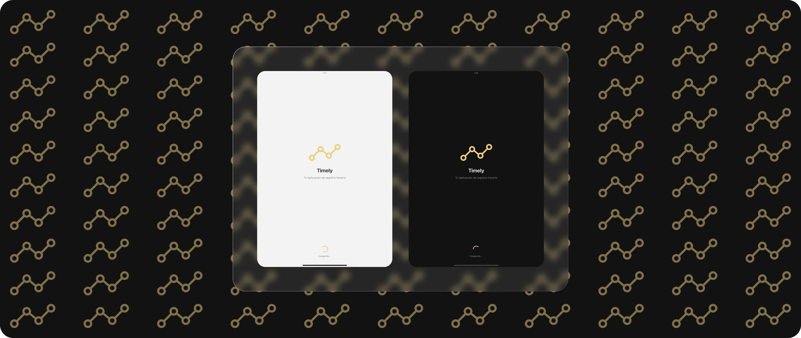
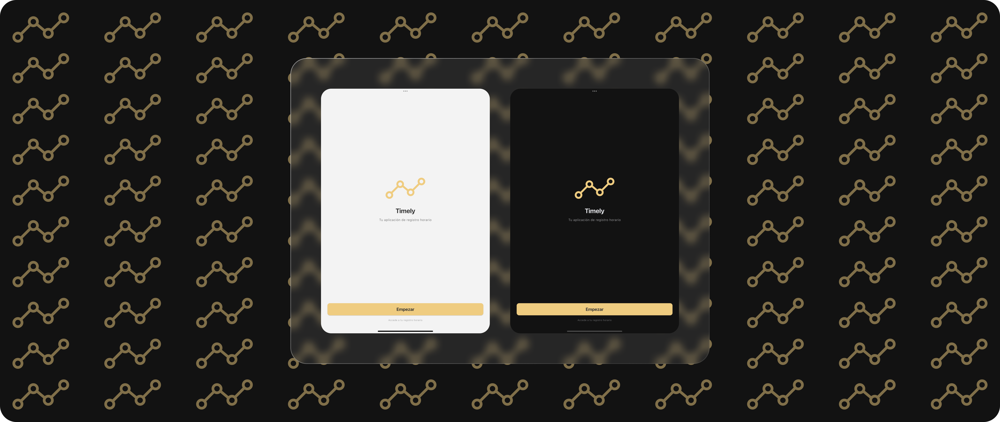
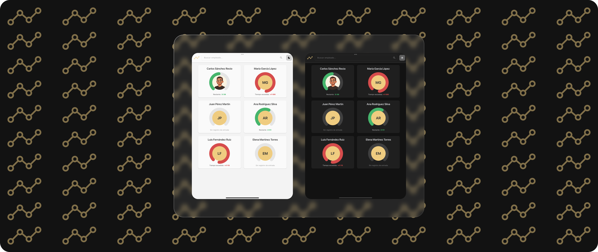
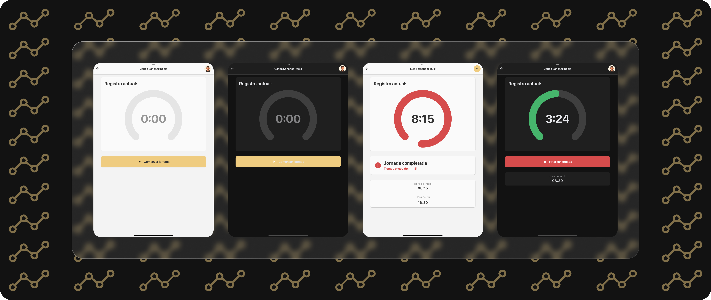

# Timely - Time Registration Application

   

A modern and efficient mobile application for employee time registration, built with Flutter and clean architecture principles.

[View Spanish Version](./README.esp.md)

---

## Table of Contents

-  [Overview](#overview)
-  [Features](#features)
-  [Technology Stack](#technology-stack)
-  [Documentation](#documentation)
-  [Screenshots](#screenshots)
-  [License](#license)
-  [Contact](#contact)

---

## Overview

**Timely** is a time registration application that enables employees to manage their working hours in a simple, fast, and intuitive manner. The application implements clean architecture with clear separation of responsibilities and utilizes Riverpod 3.0 for state management.

### Key Benefits

-  Eliminates manual paper-based time tracking.
-  Automatic calculation of working hours.
-  Intuitive interface requiring minimal training.
-  Quick access from mobile devices.
-  Real-time synchronization in production mode.

---

## Features

### User Features

-  Employee time registration (check-in/check-out).
-  Automatic working hours calculation.
-  Employee list with responsive grid.
-  Real-time timer display.
-  Dark and light theme support.

### Architecture & Technical

-  Clean Architecture with MVVM pattern.
-  Riverpod 3.0 for state management.
-  Service abstraction layer (supports multiple backends).
-  Mock data implementation for development.
-  Firebase Firestore integration for production.

---

## Technology Stack

| Category             | Technology         | Purpose                       |
| -------------------- | ------------------ | ----------------------------- |
| **Framework**        | Flutter 3.10+      | UI Framework.                 |
| **Language**         | Dart 3.10+         | Programming Language.         |
| **State Management** | Riverpod 3.0       | Reactive state management.    |
| **Navigation**       | GoRouter           | Declarative routing.          |
| **Backend**          | Firebase Firestore | Production database.          |
| **Local Storage**    | SharedPreferences  | User preferences.             |
| **Assets**           | flutter_svg        | Vector images.                |
| **IDs**              | uuid               | Unique identifier generation. |
| **Dates**            | intl               | Date formatting.              |

---

## Documentation

Complete project documentation is available in [`assets/docs/`](./assets/docs/):

| Document | Description |
| --- | --- |
| [**README.md**](./assets/docs/README.md) | Technical documentation overview. |
| [**ARCHITECTURE.md**](./assets/docs/ARCHITECTURE.md) | Detailed system architecture. |
| [**STATE_MANAGEMENT.md**](./assets/docs/STATE_MANAGEMENT.md) | Complete Riverpod 3.0 guide. |
| [**EXECUTION_FLOW.md**](./assets/docs/EXECUTION_FLOW.md) | Execution flows and use cases. |
| [**USAGE.md**](./assets/docs/USAGE.md) | How to use this project. |
| [**CONTRIBUTING.md**](./assets/docs/CONTRIBUTING.md) | How to contribute to the project. |

---

## Screenshots

### Splash Screen

### Welcome Screen

### Staff Screen (Employee Grid)

### Employee Detail (Time Registration)

> **Note:** Screenshots are illustrative. The application includes both light and dark themes.

---

## License

This project is licensed under a **Custom Open Source License with Commercial Restrictions**.

### Summary

-  **Open Source**: The source code is publicly available.
-  **Contributions**: Issues and pull requests are welcome.
-  **Commercial Use**: Only the original author is authorized to distribute this software commercially.
-  **Non-Commercial Use**: Free to use for personal and non-commercial purposes.

See the [LICENSE](LICENSE) file for complete terms and conditions.

---

## Contact

If you're interested in this project for commercial purposes or have questions:

-  **Email**: [sanchezreciocarlos99@outlook.com](mailto:sanchezreciocarlos99@outlook.com).
-  **Issues**: [GitHub Issues](https://github.com/your-username/timely/issues).
-  **Discussions**: [GitHub Discussions](https://github.com/your-username/timely/discussions).

---

Made with 💙 and Flutter.

