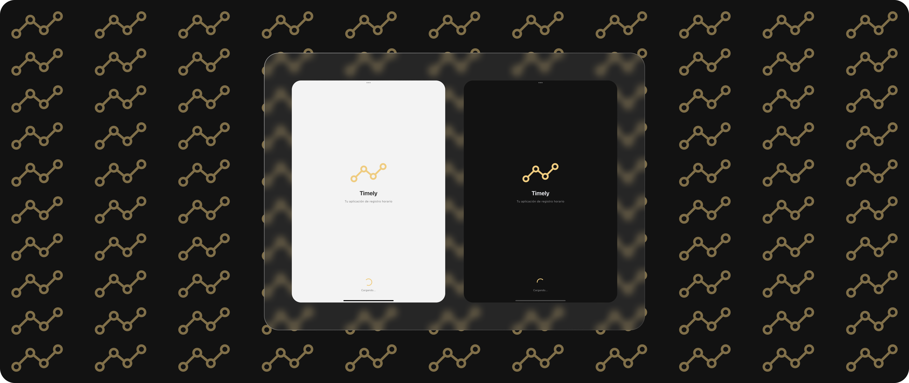
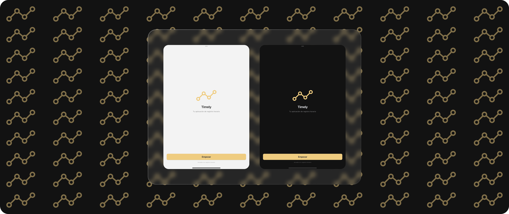
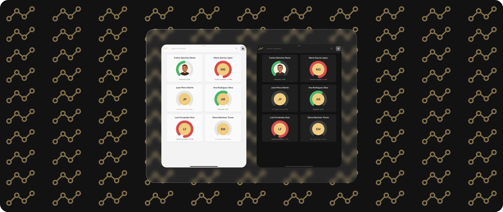
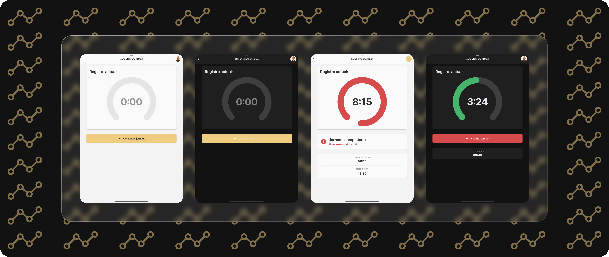

# Timely - Time Registration Application


<div align="center">

  

**Time tracking simplified for modern SMEs**

A professional mobile application designed to streamline employee time registration with minimal complexity and maximum efficiency.

[View Spanish Version](./README.esp.md) | [Website](https://timely.charlymech.com) | [Documentation](./assets/docs/README.md)

</div>

---

## Table of Contents

-  [Overview](#overview)
-  [Why Timely?](#why-timely)
-  [Key Benefits](#key-benefits)
-  [Features](#features)
-  [Technology Stack](#technology-stack)
-  [Architecture](#architecture)
-  [Documentation](#documentation)
-  [Screenshots](#screenshots)
-  [Getting Started](#getting-started)
-  [License](#license)
-  [Contact](#contact)

---

## Overview

**Timely** is a professional time registration solution built specifically for Small and Medium Enterprises (SMEs) that need reliable, compliant, and effortless employee time tracking. Unlike complex enterprise systems, Timely focuses on simplicity without sacrificing functionality or security.

### The Problem We Solve

Traditional time tracking systems present significant challenges for SMEs:
- **Overcomplicated interfaces** requiring extensive training and support
- **High costs** with unnecessary enterprise features that SMEs don't need
- **Poor user experience** leading to registration errors and frustration
- **Lack of flexibility** to adapt to different business models and schedules
- **Security concerns** with sensitive employee data and compliance requirements

### Our Solution

Timely eliminates these problems with a focused approach:
- **Intuitive Design**: Start/stop workday in just a few taps - no manual entry
- **Shared Device Model**: One tablet for the entire team with clear user selection
- **Visual Time Tracking**: Real-time gauges showing worked hours and remaining time
- **Compliance Ready**: Secure data storage prepared for labor inspections
- **Cost-Effective**: Professional solution at a fraction of enterprise system costs
- **Fully Adaptable**: Customizable to your specific business rules and schedules

---

## Why Timely?

### Built for Real-World Use Cases

Timely was designed by understanding the daily reality of SMEs:

**🌅 Morning Rush**  
Employees can quickly clock in without queues or confusion, even during peak hours.

**⏰ Overtime Tracking**  
Visual indicators (green/orange/red) immediately show work status - no calculation needed.

**📋 Inspection Ready**  
All time records stored securely and accessible for labor inspections at any time.

**🚀 Zero Training**  
Intuitive interface that anyone can use from day one - no documentation needed.

**📱 Flexible Deployment**  
Works perfectly on tablets and mobile devices with fully responsive design.

### Proven Business Impact

- ⏱️ **Save Time**: Reduce time tracking overhead by 80% compared to manual systems
- ✅ **Ensure Compliance**: Meet legal requirements with accurate, tamper-proof records
- 📊 **Gain Insights**: Understand work patterns and optimize scheduling decisions
- 💰 **Reduce Costs**: Eliminate expensive enterprise systems and manual processes
- 😊 **Improve Experience**: Happy employees with a tool that doesn't get in their way

---

## Key Benefits

### For Businesses

-  **Legal Compliance**: Automatic, secure, and auditable time registration records that meet labor law requirements
-  **Cost Reduction**: Eliminate manual time tracking and reduce administrative overhead significantly
-  **Accurate Payroll**: Precise work hour data for payroll processing - no more disputes or errors
-  **Labor Inspection Ready**: All data organized and immediately accessible for inspections
-  **Customizable Rules**: Adapt to your specific schedules, break policies, and work regulations

### For Employees

-  **Effortless Clocking**: Start/end workday in seconds with clear visual confirmation
-  **Real-Time Feedback**: See worked hours and remaining time at a glance - always know where you stand
-  **No Mistakes**: Intuitive interface prevents errors and duplicate registrations
-  **Privacy Focused**: Personal data handled securely and transparently - full GDPR compliance
-  **Always Accessible**: Works on tablets and mobile devices - clock in from anywhere

### For IT/Administrators

-  **Easy Deployment**: Quick setup on any Android/iOS device - minutes, not days
-  **Low Maintenance**: Reliable system with minimal configuration needed - set it and forget it
-  **Scalable Architecture**: Grows with your business from 5 to 500 employees without changes
-  **Secure by Design**: API-backed or mock data with clear separation of concerns
-  **Integration Ready**: Modular architecture prepared for future API integrations and exports

---

## Features

### Core Functionality

-  **Simple Time Registration**: One-tap clock-in/clock-out with instant confirmation
-  **Automatic Hour Calculation**: Real-time tracking of worked hours with minute precision
-  **Visual Status Indicators**: Color-coded gauges (green/orange/red) for instant status assessment
-  **Responsive Employee Grid**: Adaptive layout optimized for tablets and mobile devices
-  **Live Timer**: Real-time display showing current work session progress
-  **Professional Themes**: Beautiful light and dark themes that adapt to system preferences
-  **PIN-Protected Access**: Secure 6-digit PIN verification for accessing employee personal data

### Smart Time Tracking System

Our intelligent 7-hour workday tracking system provides immediate visual feedback:

-  **🟢 Green Zone (6h45m - 7h15m)**: Optimal work time achieved - target met
-  **🟠 Orange Zone (7h16m - 7h59m)**: Approaching overtime threshold - awareness alert
-  **🔴 Red Zone (8h+)**: Overtime threshold reached - management notification

Additional smart features:
-  **Remaining Time Display**: Clear countdown of time left in standard workday
-  **Session Validation**: Prevents duplicate registrations and common errors
-  **Complete History**: Full log of all time registrations with search and filter
-  **Offline Support**: Works without internet - syncs when connection restored

### Employee Profile & Shift Management

Comprehensive employee self-service features:

-  **📊 Employee Profile**: Personalized dashboard with shift calendar and time registration history
-  **📅 Shift Calendar**: Interactive monthly/weekly calendar view showing scheduled shifts
-  **🔄 Shift Types**: Support for morning, afternoon, evening, and night shifts with visual color coding
-  **📈 Monthly Statistics**: Track monthly shifts count and time registrations
-  **🎯 Today's Overview**: Quick view of today's shift details and current registration status
-  **📋 Full Registration History**: Paginated view of all past time registrations with detailed information
-  **🔍 Advanced Filtering**: Filter registrations by date range, status, or shift type

### Data Privacy & Compliance

-  **Privacy-First Design**: Dedicated data privacy information screen
-  **GDPR Compliance**: Transparent data handling and user rights information
-  **Secure Data Storage**: All sensitive information encrypted and securely stored
-  **Audit Trail**: Complete tracking of all time registration events for compliance

### Audit & Compliance

-  **Complete Audit Trail**: Every critical action is logged for compliance and traceability
-  **Action Tracking**: Track CREATE, UPDATE, DELETE operations across all entities
-  **Source Identification**: Distinguish between APP and DASHBOARD originated actions
-  **Actor Tracking**: Record who performed each action (employee or admin user)
-  **Time Registration Auditing**: Full history of workday actions (START, PAUSE, RESUME, END)
-  **Login Auditing**: Track all authentication attempts with timestamp and result

### Technical Excellence

-  **Clean Architecture**: MVVM pattern with clear separation of concerns for maintainability
-  **Riverpod 3.0 State Management**: Reactive, testable, and highly maintainable state handling
-  **Service Abstraction Layer**: Easily switch between mock data (development) or REST API (production)
-  **REST API Ready**: HTTP client infrastructure prepared for future API migration
-  **Local Preferences**: SharedPreferences for user settings and app configuration
-  **Declarative Navigation**: GoRouter for type-safe, declarative routing patterns

---

## Technology Stack

### Frontend Layer

| Technology            | Version | Purpose                              |
| --------------------- | ------- | ------------------------------------ |
| **Flutter**           | 3.10+   | Cross-platform UI framework          |
| **Dart**              | 3.10+   | Modern programming language          |
| **Riverpod**          | 3.0     | Reactive state management            |
| **GoRouter**          | Latest  | Declarative routing solution         |
| **flutter_svg**       | Latest  | Scalable vector graphics rendering   |
| **intl**              | Latest  | Internationalization & date handling |
| **table_calendar**    | Latest  | Interactive calendar widget          |

### Backend & Services

| Technology              | Purpose                           |
| ----------------------- | --------------------------------- |
| **REST API (Dio)**      | Production backend                 |
| **Mock services**       | Development & testing               |
| **Dio**                 | HTTP client for REST API          |
| **SharedPreferences**   | Local user preferences storage    |
| **uuid**                | Unique identifier generation      |
| **Mock Services**       | Development & testing environment |
| **Audit Services**      | Compliance and traceability logging |

### Development Tools

| Tool                      | Purpose                              |
| ------------------------- | ------------------------------------ |
| **Flutter DevTools**      | Debugging & performance profiling    |
| **flutter_native_splash** | Native splash screen configuration   |
| **package_info_plus**     | App version & build information      |

---

## Architecture

### Clean Architecture Implementation

Our architecture follows Clean Architecture principles with three well-defined layers:

```
┌─────────────────────────────────────────────┐
│         Presentation Layer                  │
│  • Screens (UI)                             │
│  • Widgets (Reusable Components)            │
│  • ViewModels (Business Logic)              │
└──────────────────┬──────────────────────────┘
                   │
┌──────────────────▼──────────────────────────┐
│           Domain Layer                      │
│  • Models (Entities)                        │
│  • Repositories (Data Orchestration)        │
└──────────────────┬──────────────────────────┘
                   │
┌──────────────────▼──────────────────────────┐
│            Data Layer                       │
│  • Services (Mock / API)                    │
│  • Data Sources (API / Local Storage)       │
└─────────────────────────────────────────────┘
```

### Key Architectural Patterns

**1. MVVM (Model-View-ViewModel)**
- Clear separation between UI and business logic
- Testable ViewModels using Riverpod Notifiers
- Reactive state updates with minimal boilerplate

**2. Repository Pattern**
- Single source of truth for all data operations
- Orchestrates between multiple services seamlessly
- Handles business logic and data transformation

**3. Service Abstraction**
- Interface-based service design for flexibility
- Interchangeable implementations (Mock/API)
- Environment-based configuration (dev/prod)

**4. Dependency Injection**
- Provider-based DI using Riverpod
- Easy unit testing and mocking
- Scoped lifecycle management

### Environment Configuration

Timely supports multiple environments:

- **Development (`FLAVOR=dev`)**: Uses mock data, no backend required
- **API (`FLAVOR=api`)**: REST API backend with configurable base URL
- **API (`FLAVOR=api`)**: REST API backend (future implementation)

Switch between environments with a simple command flag.

---

## Documentation

Complete technical documentation is available in the [`assets/docs/`](./assets/docs/) directory:

| Document | Description |
| -------- | ----------- |
| [**README.md**](./assets/docs/README.md) | Technical documentation overview and guide |
| [**ARCHITECTURE.md**](./assets/docs/ARCHITECTURE.md) | Detailed system architecture and design decisions |
| [**STATE_MANAGEMENT.md**](./assets/docs/STATE_MANAGEMENT.md) | Complete Riverpod 3.0 implementation guide |
| [**EXECUTION_FLOW.md**](./assets/docs/EXECUTION_FLOW.md) | User flows, use cases, and execution paths |
| [**DATA_MODEL.md**](./assets/docs/DATA_MODEL.md) | Complete data model documentation and relationships |
| [**USAGE.md**](./assets/docs/USAGE.md) | How to run, build, and deploy the project |
| [**CONTRIBUTING.md**](./assets/docs/CONTRIBUTING.md) | Guidelines for contributing to the project |
---

## Screenshots

<div align="center">

### Splash Screen


### Welcome Screen


### Staff Screen (Employee Grid)


### Employee Detail (Time Registration)


</div>

> **Note:** Screenshots showcase both light and dark themes. The application automatically adapts to system preferences for optimal user experience.

---

## Getting Started

### Prerequisites

Ensure you have the following installed:

- **Flutter SDK**: Version 3.10.0 or higher
- **Dart SDK**: Version 3.10.0 or higher  
- **IDE**: Android Studio, VS Code, or IntelliJ IDEA
- **Mobile Setup**: Android SDK / Xcode for iOS development
### Quick Start (Development Mode)

1. **Clone the repository**
   ```bash
   git clone https://github.com/charlymech/timely.git
   cd timely
   ```

2. **Install dependencies**
   ```bash
   flutter pub get
   ```

3. **Run with mock data**
   ```bash
   flutter run --dart-define=FLAVOR=dev
   ```

   This runs Timely with mock data - perfect for testing and development!

### API Mode (REST backend)

1. **Configure environment**
   ```bash
   cp lib/config/env.example.dart lib/config/env.dart
   ```
   Edit `lib/config/env.dart` if you need to change the default API URL or tokens.

2. **Run with API backend**
   ```bash
   flutter run --dart-define=FLAVOR=api --dart-define=API_URL=https://your-api.example.com
   ```

### Building for Release

**Android APK:**
```bash
flutter build apk --dart-define=FLAVOR=api --release
```

**Android App Bundle (for Play Store):**
```bash
flutter build appbundle --dart-define=FLAVOR=api --release
```

**iOS IPA:**
```bash
flutter build ipa --dart-define=FLAVOR=api --release
```

---

## License

This project is licensed under a **Custom Open Source License with Commercial Restrictions**.

### What You Can Do ✅

-  View and study the source code
-  Use for personal learning and educational purposes
-  Create non-commercial forks and modifications
-  Submit issues and pull requests to improve the project
-  Use for internal business purposes (non-commercial)

### What You Cannot Do ❌

-  Use Timely for commercial purposes without explicit written permission
-  Distribute commercially or sell the software
-  Offer Timely as a paid service
-  Remove or alter copyright notices and license information

### Commercial Licensing

**Only the original author (Carlos Sánchez Recio) has the exclusive right to:**
- Distribute the software commercially
- Create and sell commercial versions
- Offer Timely as a service for commercial purposes
- Grant commercial licenses to third parties

For commercial inquiries, please contact: [sanchezreciocarlos99@outlook.com](mailto:sanchezreciocarlos99@outlook.com)

See the [LICENSE](LICENSE) file for complete legal terms and conditions.

---

## Contact

### 💼 Commercial Inquiries & Custom Solutions

Interested in using Timely for your business or need a custom solution?

-  **Email**: [sanchezreciocarlos99@outlook.com](mailto:sanchezreciocarlos99@outlook.com)
-  **Website**: [timely.charlymech.com](https://timely.charlymech.com)
-  **Portfolio**: [charlymech.com](https://charlymech.com)

### 🐛 Development & Support

-  **Report Bugs**: [GitHub Issues](https://github.com/charlymech/timely/issues)
-  **Feature Requests**: [GitHub Discussions](https://github.com/charlymech/timely/discussions)
-  **Documentation**: [Project Wiki](https://github.com/charlymech/timely/wiki)

### 🤝 Connect with Me

-  **LinkedIn**: [linkedin.com/in/charlymech](https://linkedin.com/in/charlymech)
-  **GitHub**: [@charlymech](https://github.com/charlymech)
-  **Twitter**: [@charlymech](https://twitter.com/charlymech)

---

<div align="center">

**Made with 💙 and Flutter**

by **Carlos Sánchez Recio** ([@CharlyMech](https://github.com/charlymech))

[⬆ Back to Top](#timely---time-registration-application)

</div>