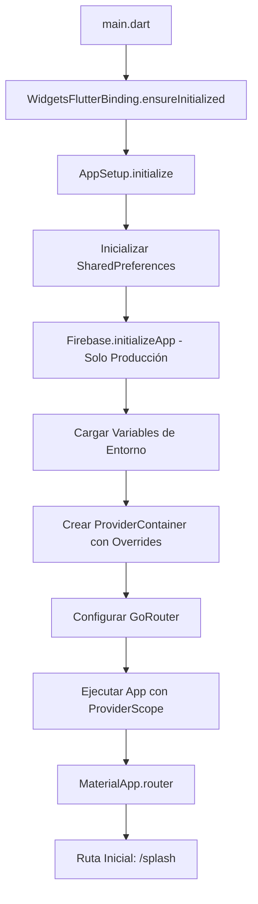
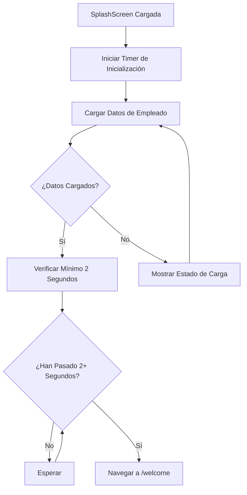
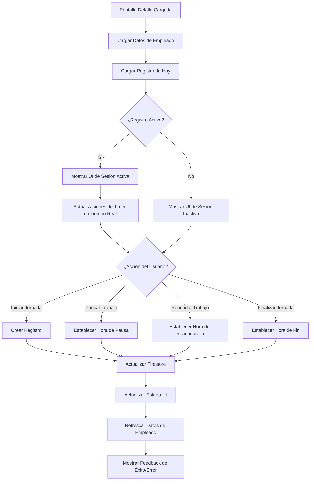
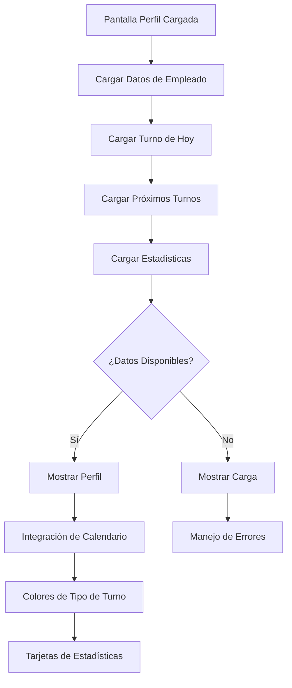
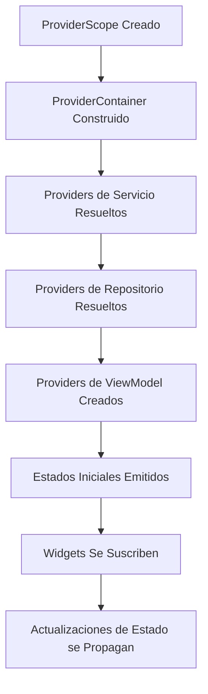
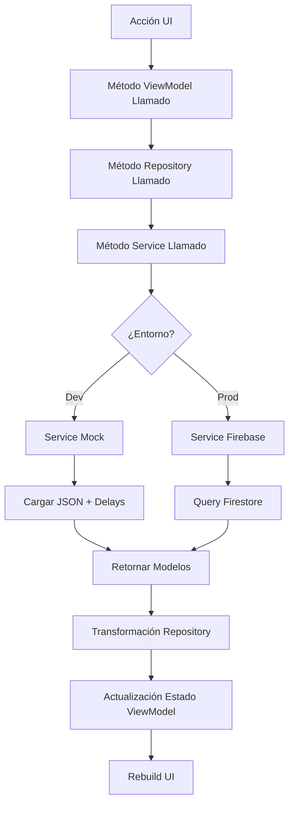
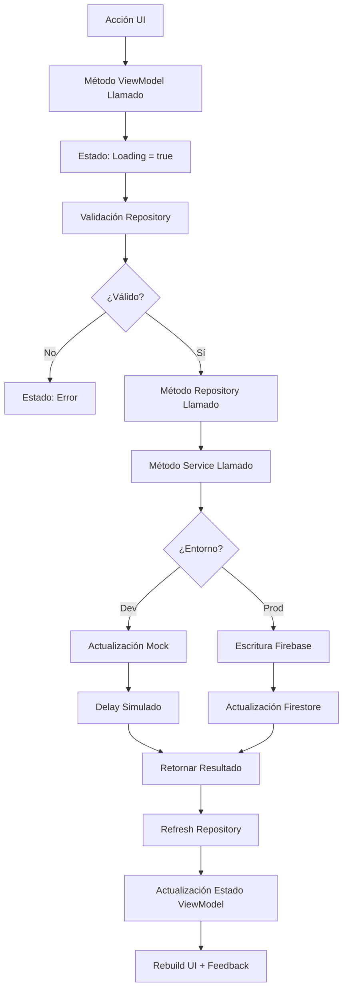
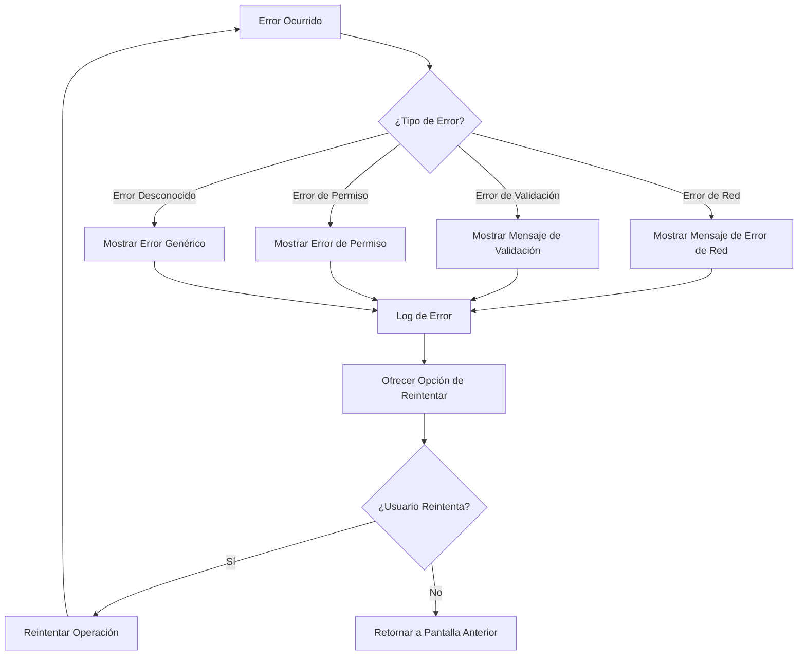

# Flujo de Ejecución de Timely

## Visión General

Este documento detalla el flujo de ejecución completo de la aplicación Timely, desde la inicialización hasta las interacciones del usuario y operaciones de datos. Cubre transiciones de pantallas, flujos de gestión de estado y patrones de procesamiento de datos.

---

## Tabla de Contenidos

1. [Flujo de Inicio de la Aplicación](#flujo-de-inicio-de-la-aplicación)
2. [Flujo de Navegación](#flujo-de-navegación)
3. [Flujos Específicos de Pantalla](#flujos-específicos-de-pantalla)
4. [Flujos de Gestión de Estado](#flujos-de-gestión-de-estado)
5. [Flujos de Operaciones de Datos](#flujos-de-operaciones-de-datos)
6. [Flujos de Manejo de Errores](#flujos-de-manejo-de-errores)
7. [Procesos en Segundo Plano](#procesos-en-segundo-plano)

---

## Flujo de Inicio de la Aplicación

### Secuencia de Inicialización



### Pasos de Inicialización Detallados

#### 1. Función Main de Entrada

```dart
void main() async {
  // Asegurar que los bindings de Flutter estén inicializados
  WidgetsFlutterBinding.ensureInitialized();
  
  // Inicializar app con configuración específica del entorno
  final container = await AppSetup.initialize();
  
  // Ejecutar con provider scope
  runApp(
    ProviderScope(
      overrides: container.overrides,
      child: const App(),
    ),
  );
}
```

#### 2. Inicialización de AppSetup

```dart
class AppSetup {
  static Future<ProviderContainer> initialize() async {
    // 1. Inicializar SharedPreferences
    final sharedPreferences = await SharedPreferences.getInstance();
    
    // 2. Inicializar Firebase (solo producción)
    if (Environment.isProd) {
      await Firebase.initializeApp(
        options: DefaultFirebaseOptions.currentPlatform,
      );
    }
    
    // 3. Crear container con overrides de entorno
    final container = ProviderContainer(
      overrides: [
        sharedPreferencesProvider.overrideWithValue(sharedPreferences),
      ],
    );
    
    // 4. Precargar datos críticos
    await _preloadCriticalData(container);
    
    return container;
  }
}
```

#### 3. Configuración de Entorno

```dart
// Detección de entorno basada en variable FLAVOR
class Environment {
  static const String flavor = String.fromEnvironment('FLAVOR', defaultValue: 'dev');
  
  static bool get isDev => flavor == 'dev';
  static bool get isProd => flavor == 'prod';
  
  // Selección de servicio basada en entorno
  static T selectService<T>({
    required T devService,
    required T prodService,
  }) {
    return isDev ? devService : prodService;
  }
}
```

---

## Flujo de Navegación

### Estructura de Rutas

```
/splash                    (SplashScreen)
    ↓ (2 segundos + carga de datos)
/welcome                   (WelcomeScreen)
    ↓ (Tap "Empezar")
/staff                     (StaffScreen)
    ↓ (Tap empleado)
/employee/:id              (TimeRegistrationDetailScreen)
    ↓ (Pestañas de navegación)
  ├── /employee/:id/profile          (EmployeeProfileScreen)
  └── /employee/:id/registrations   (EmployeeRegistrationsScreen)
    ↓ (Menú de navegación)
/data-privacy              (DataPrivacyScreen)
    ↓ (Condiciones de error)
/error                    (ErrorScreen)
```

### Implementación de Navegación

#### Configuración de GoRouter

```dart
final router = GoRouter(
  initialLocation: '/splash',
  routes: [
    // Ruta de splash
    GoRoute(
      path: '/splash',
      name: 'splash',
      builder: (context, state) => const SplashScreen(),
    ),

    // Ruta de bienvenida
    GoRoute(
      path: '/welcome',
      name: 'welcome',
      builder: (context, state) => const WelcomeScreen(),
    ),

    // Ruta de personal
    GoRoute(
      path: '/staff',
      name: 'staff',
      builder: (context, state) => const StaffScreen(),
    ),

    // Rutas de empleado con estructura anidada
    GoRoute(
      path: '/employee/:id',
      name: 'employee',
      builder: (context, state) => TimeRegistrationDetailScreen(
        employeeId: state.pathParameters['id']!,
      ),
      routes: [
        // Sub-ruta de perfil
        GoRoute(
          path: '/profile',
          name: 'employee-profile',
          builder: (context, state) => EmployeeProfileScreen(
            employeeId: state.pathParameters['id']!,
          ),
        ),
        // Sub-ruta de registros
        GoRoute(
          path: '/registrations',
          name: 'employee-registrations',
          builder: (context, state) => EmployeeRegistrationsScreen(
            employeeId: state.pathParameters['id']!,
          ),
        ),
      ],
    ),

    // Ruta de privacidad de datos
    GoRoute(
      path: '/data-privacy',
      name: 'data-privacy',
      builder: (context, state) => const DataPrivacyScreen(),
    ),

    // Ruta de error
    GoRoute(
      path: '/error',
      name: 'error',
      builder: (context, state) {
        final error = state.extra as String?;
        return ErrorScreen(message: error);
      },
    ),
  ],
  errorBuilder: (context, state) => ErrorScreen(
    message: 'Error de navegación: ${state.error}',
  ),
);
```

---

## Flujos Específicos de Pantalla

### 1. Flujo de SplashScreen



#### Implementación de SplashScreen

```dart
class SplashScreen extends ConsumerStatefulWidget {
  @override
  ConsumerState<SplashScreen> createState() => _SplashScreenState();
}

class _SplashScreenState extends ConsumerState<SplashScreen> {
  @override
  void initState() {
    super.initState();
    _initializeApp();
  }

  Future<void> _initializeApp() async {
    // Iniciar timer para tiempo mínimo de visualización
    final minDisplayTime = Future.delayed(const Duration(seconds: 2));
    
    // Cargar datos
    final dataLoad = ref.read(employeeViewModelProvider.notifier).loadEmployees();
    
    // Esperar que ambos completen
    await Future.wait([minDisplayTime, dataLoad]);
    
    // Navegar a pantalla de bienvenida
    if (mounted) {
      context.go('/welcome');
    }
  }

  @override
  Widget build(BuildContext context) {
    return Scaffold(
      body: Center(
        child: Column(
          mainAxisAlignment: MainAxisAlignment.center,
          children: [
            // Logo de la app
            Image.asset('assets/images/logo.png', width: 120, height: 120),
            const SizedBox(height: 24),
            // Indicador de carga
            const CircularProgressIndicator(),
          ],
        ),
      ),
    );
  }
}
```

### 2. Flujo de StaffScreen

```mermaid
graph TD
    A[Pantalla Staff Cargada] --> B[Cargar Empleados]
    B --> C{¿Datos Disponibles?}
    C -->|Sí| E[Mostrar Grid de Empleados]
    C -->|No| F[Mostrar Carga]
    E --> G[Iniciar Timer de Inactividad]
    G --> H[Detección de Interacción del Usuario]
    H --> I[Reiniciar Timer de Inactividad]
    I --> J[Continuar Monitoreo]
    J --> G
    J --> K{¿Inactividad > 5 min?}
    K -->|Sí| L[Navegar a /staff (refresh)]
    K -->|No| J
    F --> M[Estado de Error]
    M --> N[Mostrar Botón de Reintentar]
    N --> B
```

#### Características Clave de StaffScreen

**Layout de Grid de Empleados:**
```dart
class _StaffScreenState extends ConsumerState<StaffScreen> {
  Timer? _inactivityTimer;

  @override
  void initState() {
    super.initState();
    _startInactivityTimer();
  }

  int _calculateCrossAxisCount(double width) {
    if (width < 600) return 2;      // Móvil
    else if (width < 900) return 3; // Tablet pequeña
    else if (width < 1200) return 4; // Tablet grande
    else return 5;                   // Desktop
  }

  void _startInactivityTimer() {
    _inactivityTimer?.cancel();
    _inactivityTimer = Timer(const Duration(minutes: 5), () {
      // Auto-refresh después de 5 minutos de inactividad
      context.go('/staff');
    });
  }

  void _onUserInteraction() {
    _startInactivityTimer(); // Reiniciar timer en cualquier interacción
  }
}
```

**Pull-to-Refresh:**
```dart
RefreshIndicator(
  onRefresh: () async {
    await ref.read(employeeViewModelProvider.notifier).loadEmployees();
  },
  child: GridView.builder(
    gridDelegate: SliverGridDelegateWithFixedCrossAxisCount(
      crossAxisCount: _calculateCrossAxisCount(constraints.maxWidth),
      childAspectRatio: 0.8,
    ),
    itemBuilder: (context, index) {
      final employee = state.employees[index];
      return EmployeeCard(
        employee: employee,
        onTap: () {
          _onUserInteraction();
          context.go('/employee/${employee.id}');
        },
      );
    },
  ),
)
```

### 3. Flujo de TimeRegistrationDetailScreen



#### Operaciones de Jornada

**Iniciar Jornada:**
```dart
Future<void> _startWorkday(String employeeId) async {
  try {
    // Mostrar estado de carga
    setState(() => _isLoading = true);
    
    // Crear registro a través del repositorio
    await ref.read(employeeDetailViewModelProvider.notifier)
        .startWorkday(employeeId);
    
    // Mostrar feedback de éxito
    _showSuccessSnackbar('Jornada iniciada correctamente');
  } catch (e) {
    // Mostrar feedback de error
    _showErrorSnackbar('Error al iniciar jornada: $e');
  } finally {
    setState(() => _isLoading = false);
  }
}
```

**Timer en Tiempo Real:**
```dart
class _TimeRegistrationDetailScreenState 
    extends ConsumerState<TimeRegistrationDetailScreen> {
  Timer? _timer;

  @override
  void initState() {
    super.initState();
    _startTimer();
  }

  void _startTimer() {
    _timer = Timer.periodic(const Duration(seconds: 1), (timer) {
      if (mounted) {
        // Disparar rebuild para actualizar display de tiempo
        setState(() {});
      }
    });
  }

  @override
  void dispose() {
    _timer?.cancel();
    super.dispose();
  }
}
```

### 4. Flujo de EmployeeProfileScreen



---

## Flujos de Gestión de Estado

### 1. Flujo de Inicialización de Providers



### 2. Patrón de Actualización de Estado

```dart
// Patrón genérico de actualización de estado
class SomeViewModel extends Notifier<SomeState> {
  @override
  SomeState build() {
    return const SomeState();
  }

  Future<void> performAsyncOperation() async {
    // 1. Establecer estado de carga
    state = state.copyWith(isLoading: true, error: null);

    try {
      // 2. Realizar operación asíncrona
      final result = await _repository.someOperation();

      // 3. Actualizar estado con resultado
      state = state.copyWith(
        isLoading: false,
        data: result,
      );
    } catch (e) {
      // 4. Manejar error
      state = state.copyWith(
        isLoading: false,
        error: e.toString(),
      );
    }
  }
}
```

### 3. Flujo de Provider Family

```dart
// Providers family para estado parametrizado
final employeeDetailViewModelProvider = NotifierProvider.family<
    EmployeeDetailViewModel, 
    EmployeeDetailState, 
    String
>(EmployeeDetailViewModel.new);

// Uso en widget
class EmployeeScreen extends ConsumerWidget {
  final String employeeId;
  
  const EmployeeScreen({required this.employeeId});

  @override
  Widget build(BuildContext context, WidgetRef ref) {
    // Watch provider parametrizado
    final state = ref.watch(employeeDetailViewModelProvider(employeeId));
    
    return /* UI basada en estado */;
  }
}
```

---

## Flujos de Operaciones de Datos

### 1. Flujo de Operaciones de Lectura



#### Orquestación de Datos del Repositorio

```dart
class EmployeeRepository {
  Future<List<Employee>> getEmployeesWithTodayRegistration() async {
    // Fetching de datos paralelo
    final results = await Future.wait([
      _employeeService.getAllEmployees(),
      _timeRegistrationService.getRegistrationsByDate(DateTime.now()),
    ]);

    final employees = results[0] as List<Employee>;
    final registrations = results[1] as List<TimeRegistration>;

    // Lógica de negocio: Combinar datos
    return employees.map((employee) {
      final registration = registrations.firstWhere(
        (r) => r.employeeId == employee.id,
        orElse: () => null,
      );
      return employee.copyWith(currentRegistration: registration);
    }).toList();
  }
}
```

### 2. Flujo de Operaciones de Escritura



#### Patrón de Transacción para Operaciones Complejas

```dart
class EmployeeRepository {
  Future<Employee> startWorkday(String employeeId) async {
    // Operación compleja requiriendo múltiples pasos
    return await _transactionalOperation(() async {
      // 1. Obtener datos actuales del empleado
      final employee = await _employeeService.getEmployeeById(employeeId);
      
      // 2. Validar que no haya sesión activa
      if (employee.currentRegistration?.isActive == true) {
        throw Exception('El empleado ya tiene una sesión de trabajo activa');
      }
      
      // 3. Crear nuevo registro
      final registration = TimeRegistration(
        id: Uuid().v4(),
        employeeId: employeeId,
        startTime: DateTime.now(),
        date: DateUtils.formatDate(DateTime.now()),
      );
      
      // 4. Guardar registro
      await _timeRegistrationService.createRegistration(registration);
      
      // 5. Actualizar empleado con nuevo registro
      final updatedEmployee = employee.copyWith(
        currentRegistration: registration,
      );
      await _employeeService.updateEmployee(updatedEmployee);
      
      // 6. Retornar empleado actualizado
      return updatedEmployee;
    });
  }
}
```

---

## Flujos de Manejo de Errores

### 1. Manejo Global de Errores



### 2. Manejo de Errores Específico de Pantalla

```dart
class _StaffScreenState extends ConsumerState<StaffScreen> {
  @override
  Widget build(BuildContext context) {
    final state = ref.watch(employeeViewModelProvider);
    
    return state.when(
      data: (employees) {
        return _buildEmployeeGrid(employees);
      },
      loading: () {
        return const Center(child: CircularProgressIndicator());
      },
      error: (error, stack) {
        return _buildErrorState(error);
      },
    );
  }

  Widget _buildErrorState(String error) {
    return Center(
      child: Column(
        mainAxisAlignment: MainAxisAlignment.center,
        children: [
          const Icon(Icons.error_outline, size: 64),
          const SizedBox(height: 16),
          Text('Error cargando empleados', style: Theme.of(context).textTheme.headlineSmall),
          const SizedBox(height: 8),
          Text(error, style: Theme.of(context).textTheme.bodyMedium),
          const SizedBox(height: 24),
          ElevatedButton(
            onPressed: () {
              ref.read(employeeViewModelProvider.notifier).loadEmployees();
            },
            child: const Text('Reintentar'),
          ),
        ],
      ),
    );
  }
}
```

---

## Procesos en Segundo Plano

### 1. Timer de Inactividad

```dart
class InactivityManager {
  static const Duration _timeout = Duration(minutes: 5);
  Timer? _timer;

  void startTimer(VoidCallback onTimeout) {
    _timer?.cancel();
    _timer = Timer(_timeout, onTimeout);
  }

  void resetTimer(VoidCallback onTimeout) {
    startTimer(onTimeout);
  }

  void dispose() {
    _timer?.cancel();
  }
}
```

### 2. Actualizaciones de Reloj en Tiempo Real

```dart
class ClockManager {
  static final ClockManager _instance = ClockManager._internal();
  factory ClockManager() => _instance;
  ClockManager._internal();

  Timer? _timer;
  final StreamController<DateTime> _controller = StreamController.broadcast();

  Stream<DateTime> get timeStream => _controller.stream;

  void startClock() {
    _timer?.cancel();
    _timer = Timer.periodic(const Duration(seconds: 1), (timer) {
      _controller.add(DateTime.now());
    });
  }

  void stopClock() {
    _timer?.cancel();
  }

  void dispose() {
    _timer?.cancel();
    _controller.close();
  }
}
```

### 3. Observador del Sistema de Temas

```dart
class ThemeObserver {
  static void listenToSystemChanges() {
    // Escuchar cambios de tema del sistema
    WidgetsBinding.instance.addObserver(_observer);
  }

  static final _observer = WidgetsBindingObserver();
}

// En theme view model
class ThemeViewModel extends Notifier<ThemeState> {
  @override
  ThemeState build() {
    // Escuchar cambios del sistema
    _listenToSystemTheme();
    return _loadInitialTheme();
  }

  void _listenToSystemTheme() {
    WidgetsBinding.instance.addPostFrameCallback((_) {
      final brightness = MediaQuery.of(context).platformBrightness;
      if (state.themeType == ThemeType.system) {
        state = state.copyWith(systemBrightness: brightness);
      }
    });
  }
}
```

---

## Consideraciones de Rendimiento

### 1. Patrones de Lazy Loading

```dart
// Lazy loading para datasets grandes
class PaginationController {
  static const int _pageSize = 20;
  int _currentPage = 0;
  bool _hasMore = true;
  final List<Data> _items = [];

  Future<void> loadMore() async {
    if (!_hasMore) return;

    final newItems = await _repository.fetchPage(
      page: _currentPage,
      size: _pageSize,
    );

    if (newItems.length < _pageSize) {
      _hasMore = false;
    }

    _items.addAll(newItems);
    _currentPage++;
  }
}
```

### 2. Optimización de Estado

```dart
// Watching selectivo de estado
class OptimizedWidget extends ConsumerWidget {
  @override
  Widget build(BuildContext context, WidgetRef ref) {
    // Watch solo parte específica del estado
    final userName = ref.watch(
      userProvider.select((user) => user.name),
    );
    
    // Este widget solo se reconstruye cuando cambia el nombre, 
    // no todo el objeto usuario
    return Text(userName);
  }
}
```

---

## Licencia

Esta documentación es parte del proyecto Timely, licenciado bajo una Licencia de Código Abierto Personalizada con Restricciones Comerciales.

Para términos completos, ver el archivo [LICENSE](../../LICENSE).

---

**Última Actualización:** Enero 2026