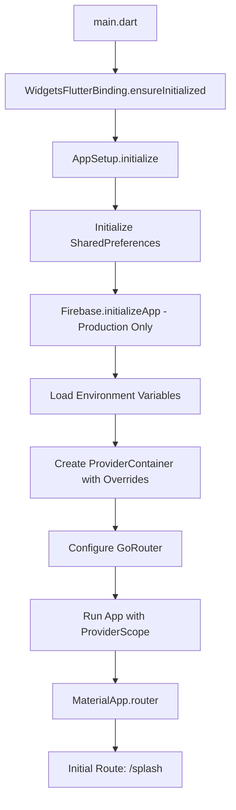
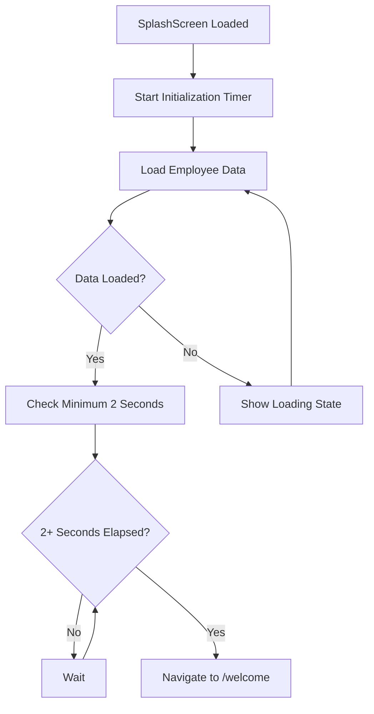
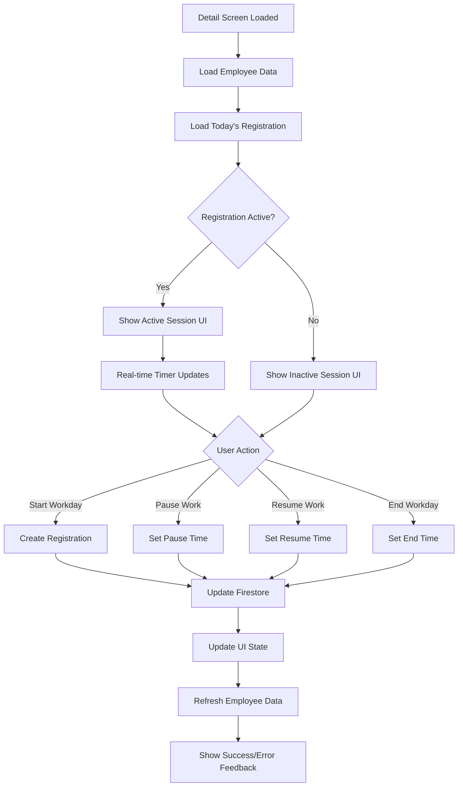
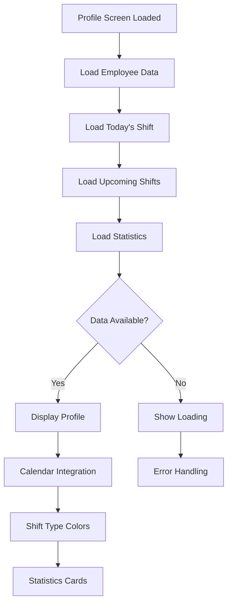
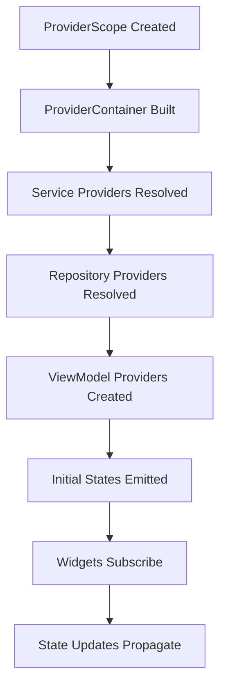
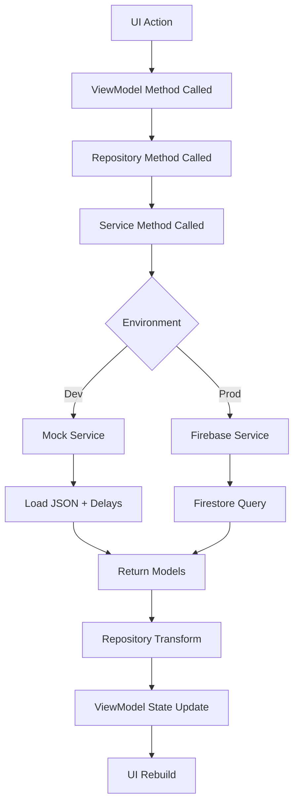
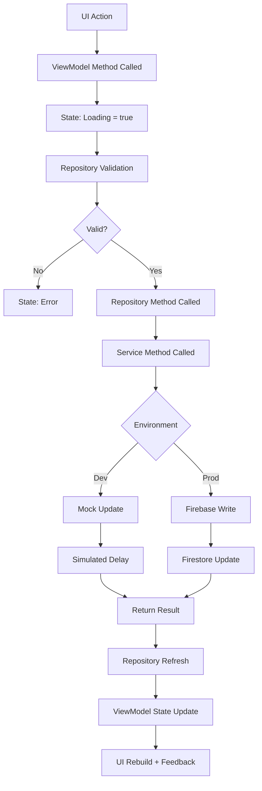
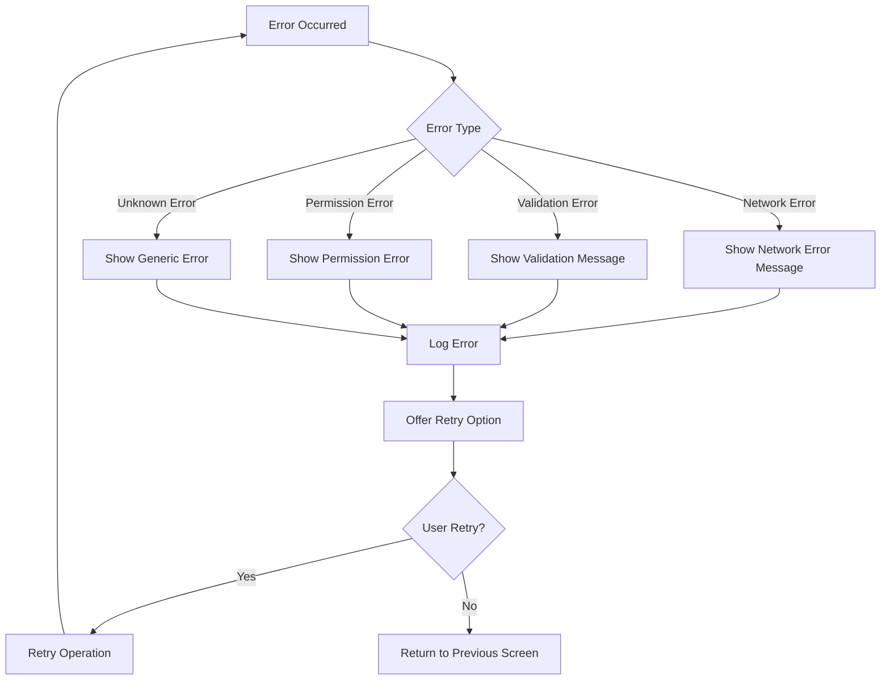

# Timely - Execution Flow

[Ver versión en español](./EXECUTION_FLOW.esp.md)

## Overview

This document details the complete execution flow of the Timely application, from initialization to user interactions and data operations. It covers screen transitions, state management flows, and data processing patterns.

---

## Table of Contents

1. [Application Startup Flow](#application-startup-flow)
2. [Navigation Flow](#navigation-flow)
3. [Screen-Specific Flows](#screen-specific-flows)
4. [State Management Flows](#state-management-flows)
5. [Data Operation Flows](#data-operation-flows)
6. [Error Handling Flows](#error-handling-flows)
7. [Background Processes](#background-processes)

---

## Application Startup Flow

### Initialization Sequence



### Detailed Startup Steps

#### 1. Main Function Entry

```dart
void main() async {
  // Ensure Flutter bindings are initialized
  WidgetsFlutterBinding.ensureInitialized();
  
  // Initialize app with environment-specific setup
  final container = await AppSetup.initialize();
  
  // Run with provider scope
  runApp(
    ProviderScope(
      overrides: container.overrides,
      child: const App(),
    ),
  );
}
```

#### 2. AppSetup Initialization

```dart
class AppSetup {
  static Future<ProviderContainer> initialize() async {
    // 1. Initialize SharedPreferences
    final sharedPreferences = await SharedPreferences.getInstance();
    
    // 2. Initialize Firebase (Production only)
    if (Environment.isProd) {
      await Firebase.initializeApp(
        options: DefaultFirebaseOptions.currentPlatform,
      );
    }
    
    // 3. Create container with environment overrides
    final container = ProviderContainer(
      overrides: [
        sharedPreferencesProvider.overrideWithValue(sharedPreferences),
      ],
    );
    
    // 4. Preload critical data
    await _preloadCriticalData(container);
    
    return container;
  }
}
```

#### 3. Environment Configuration

```dart
// Environment detection based on FLAVOR variable
class Environment {
  static const String flavor = String.fromEnvironment('FLAVOR', defaultValue: 'dev');
  
  static bool get isDev => flavor == 'dev';
  static bool get isProd => flavor == 'prod';
  
  // Service selection based on environment
  static T selectService<T>({
    required T devService,
    required T prodService,
  }) {
    return isDev ? devService : prodService;
  }
}
```

---

## Navigation Flow

### Route Structure

```
/splash                    (SplashScreen)
    ↓ (2 seconds + data loading)
/welcome                   (WelcomeScreen)
    ↓ (Tap "Empezar")
/staff                     (StaffScreen)
    ↓ (Tap employee)
/employee/:id              (TimeRegistrationDetailScreen)
    ↓ (Navigation tabs)
  ├── /employee/:id/profile          (EmployeeProfileScreen)
  └── /employee/:id/registrations   (EmployeeRegistrationsScreen)
    ↓ (Navigation menu)
/data-privacy              (DataPrivacyScreen)
    ↓ (Error conditions)
/error                    (ErrorScreen)
```

### Navigation Implementation

#### GoRouter Configuration

```dart
final router = GoRouter(
  initialLocation: '/splash',
  routes: [
    // Splash route
    GoRoute(
      path: '/splash',
      name: 'splash',
      builder: (context, state) => const SplashScreen(),
    ),

    // Welcome route
    GoRoute(
      path: '/welcome',
      name: 'welcome',
      builder: (context, state) => const WelcomeScreen(),
    ),

    // Staff route
    GoRoute(
      path: '/staff',
      name: 'staff',
      builder: (context, state) => const StaffScreen(),
    ),

    // Employee routes with nested structure
    GoRoute(
      path: '/employee/:id',
      name: 'employee',
      builder: (context, state) => TimeRegistrationDetailScreen(
        employeeId: state.pathParameters['id']!,
      ),
      routes: [
        // Profile sub-route
        GoRoute(
          path: '/profile',
          name: 'employee-profile',
          builder: (context, state) => EmployeeProfileScreen(
            employeeId: state.pathParameters['id']!,
          ),
        ),
        // Registrations sub-route
        GoRoute(
          path: '/registrations',
          name: 'employee-registrations',
          builder: (context, state) => EmployeeRegistrationsScreen(
            employeeId: state.pathParameters['id']!,
          ),
        ),
      ],
    ),

    // Data privacy route
    GoRoute(
      path: '/data-privacy',
      name: 'data-privacy',
      builder: (context, state) => const DataPrivacyScreen(),
    ),

    // Error route
    GoRoute(
      path: '/error',
      name: 'error',
      builder: (context, state) {
        final error = state.extra as String?;
        return ErrorScreen(message: error);
      },
    ),
  ],
  errorBuilder: (context, state) => ErrorScreen(
    message: 'Navigation error: ${state.error}',
  ),
);
```

---

## Screen-Specific Flows

### 1. SplashScreen Flow



#### SplashScreen Implementation

```dart
class SplashScreen extends ConsumerStatefulWidget {
  @override
  ConsumerState<SplashScreen> createState() => _SplashScreenState();
}

class _SplashScreenState extends ConsumerState<SplashScreen> {
  @override
  void initState() {
    super.initState();
    _initializeApp();
  }

  Future<void> _initializeApp() async {
    // Start timer for minimum display time
    final minDisplayTime = Future.delayed(const Duration(seconds: 2));
    
    // Load data
    final dataLoad = ref.read(employeeViewModelProvider.notifier).loadEmployees();
    
    // Wait for both to complete
    await Future.wait([minDisplayTime, dataLoad]);
    
    // Navigate to welcome screen
    if (mounted) {
      context.go('/welcome');
    }
  }

  @override
  Widget build(BuildContext context) {
    return Scaffold(
      body: Center(
        child: Column(
          mainAxisAlignment: MainAxisAlignment.center,
          children: [
            // App logo
            Image.asset('assets/images/logo.png', width: 120, height: 120),
            const SizedBox(height: 24),
            // Loading indicator
            const CircularProgressIndicator(),
          ],
        ),
      ),
    );
  }
}
```

### 2. StaffScreen Flow

```mermaid
graph TD
    A[StaffScreen Loaded] --> B[Load Employees]
    B --> C{Data Available?}
    C -->|Yes| E[Display Employee Grid]
    C -->|No| F[Show Loading]
    E --> G[Start Inactivity Timer]
    G --> H[User Interaction Detected]
    H --> I[Reset Inactivity Timer]
    I --> J[Continue Monitoring]
    J --> G
    J --> K{Inactivity > 5 min?}
    K -->|Yes| L[Navigate to /staff (refresh)]
    K -->|No| J
    F --> M[Error State]
    M --> N[Show Retry Button]
    N --> B
```

#### StaffScreen Key Features

**Employee Grid Layout:**
```dart
class _StaffScreenState extends ConsumerState<StaffScreen> {
  Timer? _inactivityTimer;

  @override
  void initState() {
    super.initState();
    _startInactivityTimer();
  }

  int _calculateCrossAxisCount(double width) {
    if (width < 600) return 2;      // Mobile
    else if (width < 900) return 3; // Small tablet
    else if (width < 1200) return 4; // Large tablet
    else return 5;                   // Desktop
  }

  void _startInactivityTimer() {
    _inactivityTimer?.cancel();
    _inactivityTimer = Timer(const Duration(minutes: 5), () {
      // Auto-refresh after 5 minutes of inactivity
      context.go('/staff');
    });
  }

  void _onUserInteraction() {
    _startInactivityTimer(); // Reset timer on any interaction
  }
}
```

**Pull-to-Refresh:**
```dart
RefreshIndicator(
  onRefresh: () async {
    await ref.read(employeeViewModelProvider.notifier).loadEmployees();
  },
  child: GridView.builder(
    gridDelegate: SliverGridDelegateWithFixedCrossAxisCount(
      crossAxisCount: _calculateCrossAxisCount(constraints.maxWidth),
      childAspectRatio: 0.8,
    ),
    itemBuilder: (context, index) {
      final employee = state.employees[index];
      return EmployeeCard(
        employee: employee,
        onTap: () {
          _onUserInteraction();
          context.go('/employee/${employee.id}');
        },
      );
    },
  ),
)
```

### 3. TimeRegistrationDetailScreen Flow



#### Workday Operations

**Start Workday:**
```dart
Future<void> _startWorkday(String employeeId) async {
  try {
    // Show loading state
    setState(() => _isLoading = true);
    
    // Create registration through repository
    await ref.read(employeeDetailViewModelProvider.notifier)
        .startWorkday(employeeId);
    
    // Show success feedback
    _showSuccessSnackbar('Jornada iniciada correctamente');
  } catch (e) {
    // Show error feedback
    _showErrorSnackbar('Error al iniciar jornada: $e');
  } finally {
    setState(() => _isLoading = false);
  }
}
```

**Real-time Timer:**
```dart
class _TimeRegistrationDetailScreenState 
    extends ConsumerState<TimeRegistrationDetailScreen> {
  Timer? _timer;

  @override
  void initState() {
    super.initState();
    _startTimer();
  }

  void _startTimer() {
    _timer = Timer.periodic(const Duration(seconds: 1), (timer) {
      if (mounted) {
        // Trigger rebuild to update time display
        setState(() {});
      }
    });
  }

  @override
  void dispose() {
    _timer?.cancel();
    super.dispose();
  }
}
```

### 4. EmployeeProfileScreen Flow



---

## State Management Flows

### 1. Provider Initialization Flow



### 2. State Update Flow Pattern

```dart
// Generic state update pattern
class SomeViewModel extends Notifier<SomeState> {
  @override
  SomeState build() {
    return const SomeState();
  }

  Future<void> performAsyncOperation() async {
    // 1. Set loading state
    state = state.copyWith(isLoading: true, error: null);

    try {
      // 2. Perform async operation
      final result = await _repository.someOperation();

      // 3. Update state with result
      state = state.copyWith(
        isLoading: false,
        data: result,
      );
    } catch (e) {
      // 4. Handle error
      state = state.copyWith(
        isLoading: false,
        error: e.toString(),
      );
    }
  }
}
```

### 3. Family Provider Flow

```dart
// Family providers for parameterized state
final employeeDetailViewModelProvider = NotifierProvider.family<
    EmployeeDetailViewModel, 
    EmployeeDetailState, 
    String
>(EmployeeDetailViewModel.new);

// Usage in widget
class EmployeeScreen extends ConsumerWidget {
  final String employeeId;
  
  const EmployeeScreen({required this.employeeId});

  @override
  Widget build(BuildContext context, WidgetRef ref) {
    // Watch parameterized provider
    final state = ref.watch(employeeDetailViewModelProvider(employeeId));
    
    return /* UI based on state */;
  }
}
```

---

## Data Operation Flows

### 1. Read Operations Flow



#### Repository Data Orchestration

```dart
class EmployeeRepository {
  Future<List<Employee>> getEmployeesWithTodayRegistration() async {
    // Parallel data fetching
    final results = await Future.wait([
      _employeeService.getAllEmployees(),
      _timeRegistrationService.getRegistrationsByDate(DateTime.now()),
    ]);

    final employees = results[0] as List<Employee>;
    final registrations = results[1] as List<TimeRegistration>;

    // Business logic: Combine data
    return employees.map((employee) {
      final registration = registrations.firstWhere(
        (r) => r.employeeId == employee.id,
        orElse: () => null,
      );
      return employee.copyWith(currentRegistration: registration);
    }).toList();
  }
}
```

### 2. Write Operations Flow



#### Transaction Pattern for Complex Operations

```dart
class EmployeeRepository {
  Future<Employee> startWorkday(String employeeId) async {
    // Complex operation requiring multiple steps
    return await _transactionalOperation(() async {
      // 1. Get current employee data
      final employee = await _employeeService.getEmployeeById(employeeId);
      
      // 2. Validate no active session
      if (employee.currentRegistration?.isActive == true) {
        throw Exception('Employee already has active work session');
      }
      
      // 3. Create new registration
      final registration = TimeRegistration(
        id: Uuid().v4(),
        employeeId: employeeId,
        startTime: DateTime.now(),
        date: DateUtils.formatDate(DateTime.now()),
      );
      
      // 4. Save registration
      await _timeRegistrationService.createRegistration(registration);
      
      // 5. Update employee with new registration
      final updatedEmployee = employee.copyWith(
        currentRegistration: registration,
      );
      await _employeeService.updateEmployee(updatedEmployee);
      
      // 6. Return updated employee
      return updatedEmployee;
    });
  }
}
```

---

## Error Handling Flows

### 1. Global Error Handling



### 2. Screen-Specific Error Handling

```dart
class _StaffScreenState extends ConsumerState<StaffScreen> {
  @override
  Widget build(BuildContext context) {
    final state = ref.watch(employeeViewModelProvider);
    
    return state.when(
      data: (employees) {
        return _buildEmployeeGrid(employees);
      },
      loading: () {
        return const Center(child: CircularProgressIndicator());
      },
      error: (error, stack) {
        return _buildErrorState(error);
      },
    );
  }

  Widget _buildErrorState(String error) {
    return Center(
      child: Column(
        mainAxisAlignment: MainAxisAlignment.center,
        children: [
          const Icon(Icons.error_outline, size: 64),
          const SizedBox(height: 16),
          Text('Error loading employees', style: Theme.of(context).textTheme.headlineSmall),
          const SizedBox(height: 8),
          Text(error, style: Theme.of(context).textTheme.bodyMedium),
          const SizedBox(height: 24),
          ElevatedButton(
            onPressed: () {
              ref.read(employeeViewModelProvider.notifier).loadEmployees();
            },
            child: const Text('Retry'),
          ),
        ],
      ),
    );
  }
}
```

---

## Background Processes

### 1. Inactivity Timer

```dart
class InactivityManager {
  static const Duration _timeout = Duration(minutes: 5);
  Timer? _timer;

  void startTimer(VoidCallback onTimeout) {
    _timer?.cancel();
    _timer = Timer(_timeout, onTimeout);
  }

  void resetTimer(VoidCallback onTimeout) {
    startTimer(onTimeout);
  }

  void dispose() {
    _timer?.cancel();
  }
}
```

### 2. Real-time Clock Updates

```dart
class ClockManager {
  static final ClockManager _instance = ClockManager._internal();
  factory ClockManager() => _instance;
  ClockManager._internal();

  Timer? _timer;
  final StreamController<DateTime> _controller = StreamController.broadcast();

  Stream<DateTime> get timeStream => _controller.stream;

  void startClock() {
    _timer?.cancel();
    _timer = Timer.periodic(const Duration(seconds: 1), (timer) {
      _controller.add(DateTime.now());
    });
  }

  void stopClock() {
    _timer?.cancel();
  }

  void dispose() {
    _timer?.cancel();
    _controller.close();
  }
}
```

### 3. Theme System Observer

```dart
class ThemeObserver {
  static void listenToSystemChanges() {
    // Listen to system theme changes
    WidgetsBinding.instance.addObserver(_observer);
  }

  static final _observer = WidgetsBindingObserver();
}

// In theme view model
class ThemeViewModel extends Notifier<ThemeState> {
  @override
  ThemeState build() {
    // Listen to system changes
    _listenToSystemTheme();
    return _loadInitialTheme();
  }

  void _listenToSystemTheme() {
    WidgetsBinding.instance.addPostFrameCallback((_) {
      final brightness = MediaQuery.of(context).platformBrightness;
      if (state.themeType == ThemeType.system) {
        state = state.copyWith(systemBrightness: brightness);
      }
    });
  }
}
```

---

## Performance Considerations

### 1. Lazy Loading Patterns

```dart
// Lazy loading for large datasets
class PaginationController {
  static const int _pageSize = 20;
  int _currentPage = 0;
  bool _hasMore = true;
  final List<Data> _items = [];

  Future<void> loadMore() async {
    if (!_hasMore) return;

    final newItems = await _repository.fetchPage(
      page: _currentPage,
      size: _pageSize,
    );

    if (newItems.length < _pageSize) {
      _hasMore = false;
    }

    _items.addAll(newItems);
    _currentPage++;
  }
}
```

### 2. State Optimization

```dart
// Selective state watching
class OptimizedWidget extends ConsumerWidget {
  @override
  Widget build(BuildContext context, WidgetRef ref) {
    // Watch only specific part of state
    final userName = ref.watch(
      userProvider.select((user) => user.name),
    );
    
    // This widget only rebuilds when name changes, not entire user object
    return Text(userName);
  }
}
```

---

## License

This documentation is part of the Timely project, licensed under a Custom Open Source License with Commercial Restrictions.

For complete terms, see the [LICENSE](../../LICENSE) file.

---

**Last Updated:** January 2026