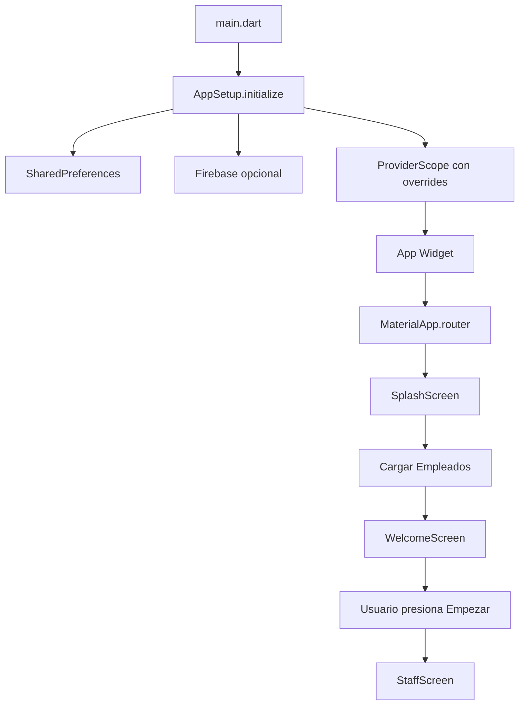

# Timely - Documentación Técnica

## Índice

1. [Visión General](#visión-general)
2. [Arquitectura del Proyecto](#arquitectura-del-proyecto)
3. [State Management](#state-management)
4. [Flujo de Ejecución](#flujo-de-ejecución)
5. [Estructura de Carpetas](#estructura-de-carpetas)
6. [Guía de Desarrollo](#guía-de-desarrollo)

## Visión General

**Timely** es una aplicación móvil de registro horario desarrollada en Flutter que permite a los empleados gestionar sus jornadas laborales de manera simple y eficiente.

### Características Principales

-  ✅ Registro de entrada y salida de empleados
-  ✅ Visualización de empleados en grid responsivo
-  ✅ Detalle de registros horarios por empleado
-  ✅ Cálculo automático de horas trabajadas
-  ✅ Soporte para modo desarrollo (mock) y producción (Firebase)
-  ✅ Temas claro y oscuro
-  ✅ Timeout de inactividad (5 minutos)

### Tecnologías Utilizadas

-  **Flutter 3.10+** - Framework UI multiplataforma
-  **Dart 3.10+** - Lenguaje de programación
-  **Riverpod 3.0** - State management
-  **GoRouter** - Navegación declarativa
-  **Firebase** - Backend (Firestore)
-  **SharedPreferences** - Persistencia local

---

## Arquitectura del Proyecto

La aplicación sigue una **arquitectura limpia** (Clean Architecture) con separación clara de responsabilidades:

```
┌─────────────────────────────────────────────────┐
│                   UI Layer                      │
│  (Screens, Widgets, ViewModels)                 │
└─────────────────┬───────────────────────────────┘
                  │
┌─────────────────▼───────────────────────────────┐
│              Repository Layer                   │
│  (Business Logic, Data Orchestration)           │
└─────────────────┬───────────────────────────────┘
                  │
┌─────────────────▼───────────────────────────────┐
│               Service Layer                     │
│  (Data Sources: Firebase, Mock)                 │
└─────────────────────────────────────────────────┘
```

### Capas de la Arquitectura

#### 1. **UI Layer (Presentación)**

-  **Screens**: Pantallas completas de la aplicación
-  **Widgets**: Componentes reutilizables
-  **ViewModels**: Gestión del estado de UI usando Riverpod Notifiers

#### 2. **Repository Layer (Dominio)**

-  Orquesta múltiples servicios
-  Implementa lógica de negocio
-  Combina datos de diferentes fuentes

#### 3. **Service Layer (Datos)**

-  Abstracción de fuentes de datos
-  Implementaciones específicas (Firebase, Mock)
-  Operaciones CRUD

#### 4. **Models (Entidades)**

-  Modelos de dominio inmutables
-  Serialización/Deserialización
-  Lógica de validación

---

## State Management

### Riverpod 3.0

Timely utiliza **Riverpod 3.0** con la nueva API de `Notifier` para gestión de estado.

#### Providers Principales

```dart
// Provider de empleados
final employeeViewModelProvider =
    NotifierProvider<EmployeeViewModel, EmployeeState>(
        EmployeeViewModel.new
    );

// Provider de detalle de empleado (family)
final employeeDetailViewModelProvider =
    NotifierProvider.family<EmployeeDetailViewModel, EmployeeDetailState, String>(
        EmployeeDetailViewModel.new
    );

// Provider de tema
final themeViewModelProvider =
    NotifierProvider<ThemeViewModel, ThemeState>(
        ThemeViewModel.new
    );
```

#### Estructura de un ViewModel

```dart
class EmployeeViewModel extends Notifier<EmployeeState> {
  late EmployeeRepository _repository;

  @override
  EmployeeState build() {
    _repository = ref.read(employeeRepositoryProvider);
    return const EmployeeState();
  }

  Future<void> loadEmployees() async {
    state = state.copyWith(isLoading: true);
    try {
      final employees = await _repository.getEmployees();
      state = state.copyWith(employees: employees, isLoading: false);
    } catch (e) {
      state = state.copyWith(error: e.toString(), isLoading: false);
    }
  }
}
```

#### Estados Inmutables

Todos los estados son clases inmutables con método `copyWith`:

```dart
class EmployeeState {
  final List<Employee> employees;
  final bool isLoading;
  final String? error;

  const EmployeeState({
    this.employees = const [],
    this.isLoading = false,
    this.error,
  });

  EmployeeState copyWith({
    List<Employee>? employees,
    bool? isLoading,
    String? error,
  }) {
    return EmployeeState(
      employees: employees ?? this.employees,
      isLoading: isLoading ?? this.isLoading,
      error: error,
    );
  }
}
```

### Mejores Prácticas

1. **Nunca modificar providers en `initState`**

   ```dart
   @override
   void initState() {
     super.initState();
     // ❌ MAL: ref.read(provider.notifier).load();
     // ✅ BIEN:
     Future.microtask(() => ref.read(provider.notifier).load());
   }
   ```

2. **Usar `ref.watch` en build, `ref.read` en callbacks**

   ```dart
   @override
   Widget build(BuildContext context) {
     // ✅ BIEN: ref.watch para reaccionar a cambios
     final state = ref.watch(employeeViewModelProvider);

     return ElevatedButton(
       // ✅ BIEN: ref.read en callbacks
       onPressed: () => ref.read(employeeViewModelProvider.notifier).load(),
       child: Text('Cargar'),
     );
   }
   ```

3. **Estados inmutables siempre**
   -  Usar `final` en todas las propiedades
   -  Implementar `copyWith` para actualizaciones
   -  No usar setters

---

## Flujo de Ejecución

### Flujo de Inicio de la Aplicación



### 1. **Inicialización (main.dart)**

```dart
void main() async {
  WidgetsFlutterBinding.ensureInitialized();
  final container = await AppSetup.initialize();
  runApp(
    ProviderScope(
      overrides: container.overrides,
      child: const App(),
    ),
  );
}
```

**Pasos:**

1. Inicializar bindings de Flutter
2. Configurar SharedPreferences
3. Configurar Firebase (si está en producción)
4. Crear container de Riverpod con overrides
5. Lanzar la aplicación

### 2. **Splash Screen**

**Ruta:** `/splash`

```dart
Future<void> _initializeApp() async {
  // 1. Cargar empleados (Future.microtask para evitar errores)
  await ref.read(employeeViewModelProvider.notifier).loadEmployees();

  // 2. Esperar mínimo 2 segundos
  await Future.delayed(const Duration(seconds: 2));

  // 3. Navegar a Welcome
  if (mounted) context.go('/welcome');
}
```

**Propósito:**

-  Precargar datos necesarios
-  Mostrar branding de la app
-  Inicializar servicios en background

### 3. **Welcome Screen**

**Ruta:** `/welcome`

**Propósito:**

-  Pantalla de bienvenida
-  Punto de entrada a la funcionalidad principal
-  Botón "Empezar" navega a `/staff`

### 4. **Staff Screen**

**Ruta:** `/staff`

**Características:**

-  Grid responsivo de empleados (2-5 columnas según ancho)
-  Pull-to-refresh
-  Timer de inactividad (5 minutos)
-  Al hacer tap en empleado: navega a `/employee/:id`

**Layout responsivo:**

```dart
int _calculateCrossAxisCount(double width) {
  if (width < 600) return 2;      // Móvil
  else if (width < 900) return 3; // Tablet pequeña
  else if (width < 1200) return 4; // Tablet grande
  else return 5;                   // Desktop
}
```

### 5. **Time Registration Detail Screen**

**Ruta:** `/employee/:id`

**Propósito:**

-  Ver detalles del empleado
-  Ver registro horario del día
-  Iniciar/finalizar jornada
-  Ver historial de registros

**Funcionalidades:**

-  Botón "Iniciar Jornada" (si no hay registro activo)
-  Botón "Finalizar Jornada" (si hay registro activo)
-  Cronómetro en tiempo real
-  Cálculo automático de horas trabajadas

---

## Estructura de Carpetas

```
lib/
├── main.dart                      # Punto de entrada
├── app.dart                       # Widget principal de la app
│
├── config/                        # Configuración
│   ├── environment.dart           # Variables de entorno (dev/prod)
│   ├── providers.dart             # Providers de Riverpod
│   ├── router.dart                # Configuración de GoRouter
│   ├── setup.dart                 # Inicialización de la app
│   └── theme.dart                 # Extensión de MyTheme a ThemeData
│
├── constants/                     # Constantes
│   └── themes.dart                # Definición de temas (light/dark)
│
├── models/                        # Modelos de dominio
│   ├── employee.dart              # Modelo de empleado
│   └── time_registration.dart     # Modelo de registro horario
│
├── repositories/                  # Capa de repositorio
│   └── employee_repository.dart   # Repositorio de empleados
│
├── services/                      # Capa de servicios
│   ├── employee_service.dart      # Interfaz de servicio de empleados
│   ├── time_registration_service.dart
│   ├── mock/                      # Implementaciones mock
│   │   ├── mock_employee_service.dart
│   │   └── mock_time_registration_service.dart
│   └── firebase/                  # Implementaciones Firebase
│       ├── firebase_employee_service.dart
│       └── firebase_time_registration_service.dart
│
├── viewmodels/                    # ViewModels (State Management)
│   ├── employee_viewmodel.dart
│   ├── employee_detail_viewmodel.dart
│   └── theme_viewmodel.dart
│
├── screens/                       # Pantallas
│   ├── splash_screen.dart
│   ├── welcome_screen.dart
│   ├── staff_screen.dart
│   └── time_registration_detail_screen.dart
│
├── widgets/                       # Widgets reutilizables
│   ├── employee_card.dart
│   └── time_registration_widget.dart
│
└── utils/                         # Utilidades
    └── date_utils.dart            # Funciones de fecha/hora
```

### Principios de Organización

1. **Por Capas**: Código organizado por responsabilidad (models, services, viewmodels)
2. **Por Feature**: Dentro de cada capa, agrupado por funcionalidad
3. **Escalabilidad**: Fácil añadir nuevas features sin afectar existentes

---

## Guía de Desarrollo

### Configuración del Entorno

#### Prerrequisitos

-  Flutter SDK 3.10+
-  Dart SDK 3.10+
-  Android Studio / VS Code
-  Emulador Android o dispositivo físico

#### Instalación

```bash
# 1. Clonar el repositorio
git clone <repository-url>
cd timely

# 2. Instalar dependencias
flutter pub get

# 3. Ejecutar en modo desarrollo (mock data)
flutter run --dart-define=FLAVOR=dev

# 4. Ejecutar en modo producción (Firebase)
flutter run --dart-define=FLAVOR=prod
```

### Modos de Ejecución

#### Modo Desarrollo (Mock)

Usa datos mock desde `assets/mock/employees.json`:

```bash
flutter run --dart-define=FLAVOR=dev
```

**Características:**

-  No requiere Firebase
-  Datos de prueba predefinidos
-  Rápido para desarrollo local

#### Modo Producción (Firebase)

Usa Firebase Firestore:

```bash
flutter run --dart-define=FLAVOR=prod
```

**Configuración requerida:**

-  Proyecto Firebase creado
-  `google-services.json` (Android)
-  `GoogleService-Info.plist` (iOS)
-  Firestore configurado

### Añadir una Nueva Feature

#### Ejemplo: Añadir módulo de "Vacaciones"

1. **Crear el modelo**

   ```dart
   // lib/models/vacation.dart
   class Vacation {
     final String id;
     final String employeeId;
     final DateTime startDate;
     final DateTime endDate;
     final VacationStatus status;

     // ... constructor, fromJson, toJson, copyWith
   }
   ```

2. **Crear el servicio**

   ```dart
   // lib/services/vacation_service.dart
   abstract class VacationService {
     Future<List<Vacation>> getVacations(String employeeId);
     Future<Vacation> requestVacation(Vacation vacation);
   }
   ```

3. **Implementar mock y Firebase**

   ```dart
   // lib/services/mock/mock_vacation_service.dart
   // lib/services/firebase/firebase_vacation_service.dart
   ```

4. **Crear el repositorio**

   ```dart
   // lib/repositories/vacation_repository.dart
   class VacationRepository {
     final VacationService _vacationService;
     // ... métodos de negocio
   }
   ```

5. **Crear el ViewModel**

   ```dart
   // lib/viewmodels/vacation_viewmodel.dart
   class VacationViewModel extends Notifier<VacationState> {
     @override
     VacationState build() => const VacationState();
     // ... métodos
   }
   ```

6. **Crear la pantalla**

   ```dart
   // lib/screens/vacation_screen.dart
   class VacationScreen extends ConsumerWidget {
     @override
     Widget build(BuildContext context, WidgetRef ref) {
       final state = ref.watch(vacationViewModelProvider);
       // ... UI
     }
   }
   ```

7. **Añadir ruta**
   ```dart
   // lib/config/router.dart
   GoRoute(
     path: '/vacations',
     name: 'vacations',
     builder: (context, state) => const VacationScreen(),
   ),
   ```

### Testing

#### Tests Unitarios

```bash
# Ejecutar todos los tests
flutter test

# Ejecutar tests con coverage
flutter test --coverage
```

#### Tests de Integración

```bash
# Ejecutar tests de integración
flutter test integration_test
```

### Best Practices

1. **Inmutabilidad**

   -  Todos los modelos y estados deben ser inmutables
   -  Usar `const` constructors cuando sea posible

2. **Separación de responsabilidades**

   -  UI no debe tener lógica de negocio
   -  ViewModels no deben conocer detalles de UI
   -  Services no deben conocer sobre estado

3. **Manejo de errores**

   -  Siempre usar try-catch en operaciones async
   -  Mostrar mensajes de error amigables al usuario
   -  Logging apropiado para debugging

4. **Rendimiento**

   -  Usar `const` widgets cuando sea posible
   -  Evitar rebuilds innecesarios
   -  Lazy loading de datos

5. **Código limpio**
   -  Nombres descriptivos
   -  Funciones pequeñas y enfocadas
   -  Comentarios solo cuando sea necesario
   -  Documentar APIs públicas

### Convenciones de Código

-  **Archivos**: `snake_case.dart`
-  **Clases**: `PascalCase`
-  **Variables/Funciones**: `camelCase`
-  **Constantes**: `camelCase` o `SCREAMING_SNAKE_CASE`
-  **Privados**: prefijo `_`

### Git Workflow

```bash
# 1. Crear rama para feature
git checkout -b feature/nombre-feature

# 2. Hacer commits descriptivos
git commit -m "feat: añadir módulo de vacaciones"

# 3. Push a remoto
git push origin feature/nombre-feature

# 4. Crear Pull Request
# 5. Code Review
# 6. Merge a main
```

---

## Troubleshooting

### Problema: "Tried to modify a provider while the widget tree was building"

**Solución:** Usar `Future.microtask` en `initState`:

```dart
@override
void initState() {
  super.initState();
  Future.microtask(() => ref.read(provider.notifier).load());
}
```

### Problema: Hot reload no aplica cambios

**Solución:** Hacer hot restart (R mayúscula)

### Problema: Firebase no conecta

**Verificar:**

1. `google-services.json` en `android/app/`
2. Configuración en Firebase Console
3. Reglas de Firestore

---

## Recursos Adicionales

-  [Flutter Documentation](https://docs.flutter.dev)
-  [Riverpod Documentation](https://riverpod.dev)
-  [GoRouter Documentation](https://pub.dev/packages/go_router)
-  [Firebase Flutter](https://firebase.flutter.dev)

---

## License

This documentation is part of the Timely project, licensed under a Custom Open Source License with Commercial Restrictions.

For complete terms, see the [LICENSE](../../LICENSE) file.

---

**Last Updated:** December 2025

**Version:** 1.0.0
